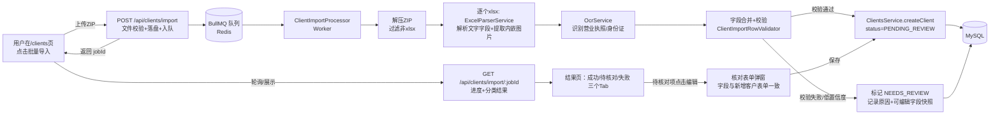
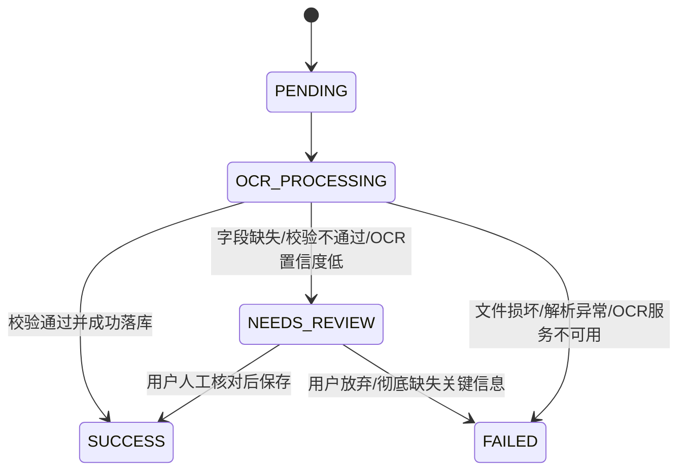

# 授权客户批量导入 - 技术方案

状态：🚧 设计阶段，未开始编码。配套模板见 `docs/授权客户批量导入模板（证件自动识别版）.xlsx`（一个 Excel 文件 = 一个客户，营业执照/身份证等图片走 OCR 自动识别 + 推断，模板不再提供这些字段的手填列）。本方案是 `docs/client-profile-design.md` 第 4 节的落地细化版，若两者冲突，以本文档为准，并同步回填第 4 节。

## 1. 需求还原

入口：`/clients` 列表页新增"批量导入"按钮 → 用户一次性提交**多个客户的 Excel 文件**（每个文件对应一个客户）→ 后端对每个文件：解析文字字段 + 提取内嵌图片 → 调用 OCR 识别营业执照/身份证 → 结构化字段回填 + 校验 → 拼装成与单条录入向导一致的 `ClientPayload` → 调用已有的 `ClientsService.createClient()` 落库。整个过程要交互友好：用户能清楚看到"在处理""哪些成功""哪些失败/待核对及原因"。

## 2. 上传方式评估：文件夹 vs 压缩包（结论：**压缩包 ZIP**）

| 维度 | 上传文件夹 | 上传 ZIP 压缩包 |
| --- | --- | --- |
| 浏览器 API | 需要 `<input webkitdirectory>`，非标准属性，Safari/部分移动端支持不稳定 | `<input type="file" accept=".zip">`，标准 API，全浏览器一致 |
| 传输方式 | 需要用 `FormData` 逐个 append 文件夹内所有文件（可能几十~上百个 `.xlsx`），一次请求体积大、字段多，容易受 Nginx/Nest 默认 body 大小限制影响，且弱网下"传了一半"难以重试 | 单个文件、单个 HTTP 字段，体积经压缩通常更小，重试语义简单（重传这一个文件即可） |
| 服务端处理 | 需要多文件 multipart 解析，逐个校验扩展名/大小，出错定位到"第几个文件"体验较绕 | 服务端先落盘/解压到临时目录，天然获得一个"批次"文件列表，代码路径统一（无论用户传 1 个还是 200 个文件，接口形状不变） |
| 用户习惯 | 需要用户提前把所有 Excel 放到同一文件夹，操作路径长 | 用户日常更熟悉"打包成压缩包发文件"，且很多操作系统（Windows/macOS）右键"压缩"是原生功能，学习成本低 |
| 断点/限速 | 大文件夹上传容易超时 | 可结合前端预校验（文件大小、数量）在上传前拦截，减少无效请求 |

**结论**：选择 **ZIP 压缩包上传**。前端限制单包大小（如 200MB）与文件数量（如 500 个），Nest 侧用 `multer` 内存/临时磁盘存储收包，用 `adm-zip`（或 `unzipper`）解压出所有 `.xlsx`，非 `.xlsx` 文件/隐藏文件（如 `__MACOSX/`、`.DS_Store`）直接跳过并计入"忽略文件"提示，不报错阻断。

## 3. 整体架构



## 4. 数据模型新增

在 `schema.prisma` 新增两张表记录批次与每个文件的处理状态（不复用 `Client.status`，因为一个批次可能远多于成功创建的客户数，需要独立追踪"文件级"处理结果）：

```prisma
enum ImportJobStatus { QUEUED PROCESSING DONE FAILED }
enum ImportItemStatus { PENDING OCR_PROCESSING SUCCESS NEEDS_REVIEW FAILED }

model ClientImportJob {
  id          String          @id @default(uuid())
  status      ImportJobStatus @default(QUEUED)
  fileName    String                          // 原始 ZIP 文件名，便于用户核对
  totalCount  Int             @default(0)      // ZIP 内识别到的有效 .xlsx 数量
  successCount Int            @default(0)
  reviewCount Int             @default(0)
  failedCount Int             @default(0)
  createdById String
  createdBy   User            @relation(fields: [createdById], references: [id])
  items       ClientImportItem[]
  createdAt   DateTime        @default(now())
  finishedAt  DateTime?
  @@index([createdById]) @@index([status])
}

model ClientImportItem {
  id           String           @id @default(uuid())
  jobId        String
  job          ClientImportJob  @relation(fields: [jobId], references: [id], onDelete: Cascade)
  fileName     String                          // ZIP 内的原始文件名，如"张三.xlsx"
  status       ImportItemStatus @default(PENDING)
  clientId     String?                          // 成功创建后回填，便于跳转详情
  errorReason  String?          @db.Text        // FAILED 原因（如"OCR服务不可用""必填字段缺失"）
  reviewFields Json?                            // NEEDS_REVIEW 时，已识别/已填字段的快照，供前端核对表单直接回填
  reviewIssues Json?                            // NEEDS_REVIEW 具体问题清单，如 [{field:"idNumber", message:"身份证校验位不通过"}]
  createdAt    DateTime         @default(now())
  updatedAt    DateTime         @updatedAt
  @@index([jobId]) @@index([status])
}
```

`ClientImportItem.reviewFields` 只存**文字字段**快照供人工核对表单展示；营业执照/身份证图片一旦文件解析成功即按第 5 节方案落盘并生成正式 `Attachment` 记录（关联到最终创建的 `Client`），即便该文件因文字字段问题被标记 `NEEDS_REVIEW`，图片也已落盘，人工核对时不需要重新贴图，只需修正文字字段。

## 5. 附件与图片存储方案

现状缺口：`Attachment` 表（`schema.prisma`）此前是预留字段，营业执照/身份证图片识别后直接丢弃、不落盘（`client-profile-design.md` 3.1.2 节旧决策）。无论走单条录入向导还是本次批量导入，客户信息都需要保留这些证件图片的可访问 URL，因此本节把 `Attachment` 落地为**单条录入向导与批量导入共用**的存储方案，两条路径复用同一段代码，是本次改动里"实现优雅"的关键点。

### 5.1 存储服务抽象

新增 `apps/api/src/storage/` 模块，沿用项目里 `SmsService`/`OcrProvider` 已验证过的"接口 + DI token 可替换 Provider"套路：

```
apps/api/src/storage/
  storage.module.ts
  file-storage.service.ts        // FILE_STORAGE token 对应的接口：save(params) => { fileUrl }
  providers/
    local-disk.provider.ts       // 落盘到 UPLOAD_DIR，按 clientId 分目录，初期唯一实现
```

- `save({ clientId, type, buffer, mimetype, originalName })` 写入 `UPLOAD_DIR/clients/{clientId}/{type}-{uuid}.{ext}`，返回相对路径作为 `fileUrl`。
- 对外访问走**鉴权下载接口** `GET /api/files/*`（校验当前用户对该 `clientId` 有访问权限，复用 `ClientsService` 现有的 `assertAccess` 逻辑），不直接用 `express.static` 暴露整个 `UPLOAD_DIR`，避免客户证件图片被越权直连访问。
- 后续若要换对象存储（OSS/S3），只需新增一个 Provider 实现同一接口，`ClientsService`/批量导入代码不用改；新增环境变量 `UPLOAD_DIR`（本地存储根目录）。

### 5.2 与 `createClient()` 的整合（两条路径唯一汇合点）

`ClientsService.createClient()` 新增一个可选参数：

```ts
attachments?: Array<{
  type: AttachmentType; // BUSINESS_LICENSE / ID_CARD_FRONT / ID_CARD_BACK
  buffer: Buffer;
  mimetype: string;
  originalName: string;
}>
```

Client 记录在事务内创建成功、拿到 `clientId` 后，逐个调用 `FileStorageService.save()` 落盘并写入 `Attachment` 记录；文件落盘发生在数据库事务**提交之后**执行——先保证客户核心数据落库，图片写盘失败只记 warning 日志、不回滚客户创建（图片是留档用途，非核心业务字段，不应因存储故障阻断主流程）。

- **单条录入向导**：向导内 OCR 识别接口（`POST /api/ocr/business-license` / `id-card`）保持不变，仍不落盘、只做识别，避免用户中途放弃向导产生孤儿文件；前端 `client-wizard-store` 额外保留用户已选择的原始 `File` 对象（识别用的图片本来就在前端内存里，之前是用完即丢），最终提交改为 `multipart/form-data`（`POST /api/clients`，用 `FileFieldsInterceptor` 接 `businessLicenseFile`/`idCardFrontFile`/`idCardBackFile` 三个可选文件字段 + JSON payload），透传给 `createClient()` 的 `attachments` 参数。
- **批量导入**：`ExcelParserService` 用 `getImages()` 已经拿到图片二进制 buffer（见第 7.2 节），直接组装成同样的 `attachments` 参数传给 `createClient()`，不需要重新实现一遍落盘逻辑。

这样"图片要不要落盘、往哪存"这个决策只在 `createClient()` 内部实现一次，两条录入路径天然保持一致，`OcrController` 本身不用改动。

### 5.3 对既有文档决策的同步更新

本节更新了 `client-profile-design.md` 3.1.2 节的旧结论（"识别完直接丢弃图片，不落盘、不建 Attachment 记录"），已同步修订该节指向本节，避免两处文档口径不一致。

## 6. 后端模块结构

```
apps/api/src/clients/import/
  client-import.module.ts
  client-import.controller.ts     // POST /import, GET /import, GET /import/:jobId, GET /import/:jobId/items, PATCH /import/items/:itemId
  client-import.service.ts        // 入队、查询、待核对项的人工修正提交
  client-import.processor.ts      // BullMQ Worker：解压→逐文件解析→OCR→校验→落库
  excel-parser.service.ts         // exceljs 解析单个 xlsx：读文字字段 + worksheet.getImages() 提取内嵌图片
  row-validator.service.ts        // 字段级校验规则（见第 7 节），产出 issues[]
  zip-extractor.service.ts        // adm-zip 解压 + 文件名过滤（仅 .xlsx，跳过隐藏/系统文件）
```

复用原则不变：无论校验通过与否，最终成功路径都调用同一个 `ClientsService.createClient(payload, actor, meta)`，不新写一套建表逻辑（呼应 `client-profile-design.md` 4.1 节）。

## 7. 处理流程细节

### 6.1 上传与入队（同步，快速返回）

`POST /api/clients/import`（multipart，字段名 `file`，仅接受 `.zip`）：
1. 校验文件扩展名/大小（如 ≤200MB），超限直接 400，不入队。
2. 用 `multer` 落盘到临时目录（`UPLOAD_TMP_DIR`，处理完/失败后清理，不长期占用磁盘）。
3. 创建 `ClientImportJob(status=QUEUED)`，往 BullMQ 丢一个任务（payload 只带 `jobId` + 临时文件路径），立即返回 `{ jobId }`，前端跳转到"导入进度"页。

### 6.2 Worker 处理（异步）

1. 解压 ZIP → 过滤出 `.xlsx` 文件列表 → 更新 `job.totalCount`，为每个文件创建一条 `ClientImportItem(status=PENDING)`。
2. 设置 BullMQ **子任务并发**（如 `concurrency=3`，避免 OCR/DB 被打满，呼应部署方案第 6.3 节资源隔离），逐文件：
   - `status → OCR_PROCESSING`
   - `ExcelParserService` 解析该 Sheet 的文字字段（联系电话/邮箱/备注/代理信息/店铺/产品，按"复制行"规则归并成 1 个客户 + N 条代理/店铺/产品）+ `getImages()` 提取营业执照/身份证正反面图片锚点。
   - 逐张图片调用 `OcrService`（与单条录入向导**共用同一服务**，保证识别口径一致）。
   - 合并 OCR 结构化字段（信用代码/公司名/地址/法人信息等）与 Excel 文字字段，拼成候选 `ClientPayload`。
   - `RowValidatorService` 跑校验规则（见第 8 节，含去重检查），无问题 → 调 `ClientsService.createClient()` 落库（连同已提取的证件图片一并传入 `attachments` 参数，见第 5.2 节），`item.status=SUCCESS`，回填 `clientId`；有问题 → `item.status=NEEDS_REVIEW`，写入 `reviewFields`（候选字段快照，供人工核对表单直接展示可编辑）+ `reviewIssues`（问题清单）；解析/OCR 阶段抛异常（如文件损坏、OCR 服务不可达）→ `item.status=FAILED`，写 `errorReason`，不影响其他文件继续处理。
3. 全部文件处理完 → `job.status=DONE`，回填 `successCount/reviewCount/failedCount`、`finishedAt`；清理临时解压目录。

### 6.3 状态机



### 6.4 与 `Client.status`（`ClientStatus`）的区别，避免混淆

`ClientImportItem.status = NEEDS_REVIEW` 不等同于 `Client.status = PENDING_REVIEW`（审核中），两者是**不同阶段、不同语义**的状态，不可合并、不可互相替代：

| | `ClientImportItem.status`（导入项状态） | `Client.status`（客户业务状态） |
| --- | --- | --- |
| 所处阶段 | `Client` 记录**尚未创建**，还在"这份数据能不能安全建档"的处理过程中 | `Client` 记录**已经创建成功**之后的业务生命周期 |
| 回答的问题 | 这份待导入数据字段完不完整、OCR 识别对不对、是不是疑似重复？ | 这个已存在的客户，业务上批不批准（`PENDING_REVIEW`/`APPROVED`/`DISABLED`）？ |
| `NEEDS_REVIEW` 触发原因 | 必填字段缺失、OCR 未识别/置信度低、格式校验位不通过、疑似重复客户等（见第 8 节） | 不适用，`Client` 一旦创建，默认即为 `PENDING_REVIEW`，与导入过程无关 |
| 时间线关系 | 在前 | 在后：导入项核对通过 → 调用 `createClient()` → 生成 `Client` 记录 → 该记录状态自然为 `PENDING_REVIEW` |

**结论**：两者是先后关系（导入待核对 → 核对通过后创建客户 → 客户进入审核中），不是同一个状态的两种叫法。如果把导入待核对项直接当成 `Client(status=PENDING_REVIEW)` 提前落库，会导致校验不通过的脏数据提前进入 `Client` 表、污染客户列表/审核统计，且与疑似重复客户"先人工确认再决定是否创建"的设计初衷矛盾，因此严禁在实现中做这种合并。

## 8. 校验规则与"待核对"触发条件

沿用你此前确认的"识别失败标记待核对"兜底方向，具体触发条件（任一命中即标记 `NEEDS_REVIEW`，不静默写错数据、不静默丢弃）：

- **必填字段缺失**：手填字段（注册类型、联系电话、代理国家/公司、生效日期、代理年限、店铺平台/名称/链接/主营类目）任一为空。
- **OCR 未识别**：营业执照/身份证图片识别 `recognized=false`，或关键字段（信用代码、身份证号、法人姓名、公司名）为空。
- **格式/校验位不通过**：统一信用代码/身份证号校验位算法不通过（复用 `services/ocr-service/parsers.py` 已有校验逻辑，Nest 侧只做结果判断，不重复实现）；手机号/邮箱格式不合法。
- **枚举值不合法**：注册类型/平台/代理国家/代理公司不在允许列表，或"代理公司"与"代理国家"不匹配（复用 `AGENT_COUNTRY_COMPANIES` 映射）。
- **图片缺失**：个人客户缺身份证正/反面图片；公司客户缺营业执照图片。
- **疑似重复客户**：按注册类型选取去重键做查重——公司类型用统一信用代码，个人类型用身份证号；两者实际上都落在同一个 `CompanyInfo.creditCode` 字段（`schema.prisma` 注释已写明"个人：creditCode 存身份证号"），不需要新增字段。查重逻辑收口为 `ClientsService.findDuplicate(creditCode)` 公共方法，供单条向导与批量导入共用：
  - **单条录入向导**：`createClient()` 事务内命中即 `throw ConflictException`，前端提示"该客户已存在（名称/手机号 XXX），请勿重复创建"，硬性阻断、不落库。
  - **批量导入**：`RowValidatorService` 在调用 `createClient()` 之前先用同一个 `findDuplicate()` 预检查，命中**不直接拒绝**，而是标记该文件 `NEEDS_REVIEW`，`reviewIssues` 写入"疑似重复客户，已存在客户「名称/手机号」，请人工确认是否继续创建"，交由业务人员判断（批量场景可能确实是要给老客户补录信息，不宜武断拒绝）。
  - 并发提示：Worker 并发数较低（2~4），同批次内两个文件撞上相同信用代码/身份证号的概率极低，当前以应用层查询实现即可；如后续观测到并发重复创建问题，再考虑在 `CompanyInfo` 补充唯一索引兜底，避免现阶段过度设计。

`reviewIssues` 结构示例：`[{ field: "legalRepInfo.idNumber", message: "身份证号校验位不通过，请核对图片是否清晰或手动修正" }]`，前端据此在核对表单里对应字段下方展示红字提示（复用单条录入向导"识别失败→提示语，字段仍可编辑"的既有交互，不做逐字段置信度高亮，保持全站兜底策略一致）。

## 9. 前端交互设计

### 9.1 弹窗 vs 独立进度页评估（结论：上传用轻量弹窗，进度/结果用独立页）

- 批量导入是**异步任务**，量大时（如 500 个文件、Worker 并发 2~4、每个文件需 1~3 次 OCR 调用）处理耗时可能是几分钟到十几分钟，用户不太可能一直守着一个 `Modal` 等待；`Modal` 更适合承载"当前页面内几秒到几十秒能结束"的短交互，不适合承载这种可能需要用户离开去做别的事、之后再回来看结果的长任务。
- 独立页面 `/clients/import/:jobId` 有**可分享/可刷新的 URL**，用户关闭浏览器、刷新页面后仍可从"导入记录"入口找回；`Modal` 一旦关闭或页面刷新，进度状态就丢失，只能重新查询，除非额外做"关闭不清空状态"的复杂处理。
- 独立页面能从容承载三个 Tab（成功/待核对/失败）+ 分页表格 + 核对表单弹窗这种**信息密度较高**的交互；如果全部塞进一个 `Modal`，核对表单还要再叠一层 `Modal`，交互层级会显得拥挤、混乱。
- 结论：**上传本身用一个轻量 `Modal`**（只做"选择 ZIP 文件 + 提交"这一步，几秒内完成），提交成功立即跳转到独立的进度/结果页，兼顾"上传快捷"与"结果可持续查看、可分享"两种诉求，这也是本方案从一开始就采用的结构（见下）。

### 9.2 入口与上传

`/clients` 列表页工具栏新增"批量导入"按钮 → 弹出 `Modal`：
- `Upload.Dragger` 拖拽/点击上传单个 `.zip`，上传前校验扩展名与大小，给出清晰的错误提示（而不是等后端 400）。
- 上传前展示一段固定说明："请将多个客户的 Excel（每个文件对应一个客户）打包为 ZIP 上传，模板下载：[授权客户批量导入模板]"，直接提供模板下载链接，降低用户找模板的成本。
- 点击"开始导入" → 调 `POST /api/clients/import` → 成功后关闭弹窗，`navigate` 跳转到 `/clients/import/:jobId` 进度页（而不是留在列表页轮询，给用户明确的"进度可查"心智）。

### 9.3 导入进度/结果页 `/clients/import/:jobId`

- 顶部：`Progress` 展示 `已处理/总数`，`job.status=PROCESSING` 时每 2~3 秒轮询 `GET /api/clients/import/:jobId`；`DONE` 后停止轮询，展示汇总统计（成功 N / 待核对 N / 失败 N）。
- 下方 `Tabs` 三个页签，各自分页 `Table`（数据来自 `GET /api/clients/import/:jobId/items?status=xxx`）：
  - **成功**：文件名 + 客户手机号/类型 + "查看详情"跳转 `Client` 详情页。
  - **待核对**：文件名 + 问题摘要（取 `reviewIssues` 第一条 + "等 N 项"）+ "去核对"按钮，点击打开一个**复用新增客户表单组件**的 `Modal`（用 `reviewFields` 预填），用户改完点"保存并创建"→ `PATCH /api/clients/import/items/:itemId`（后端校验通过后调用 `createClient`，成功后 `item.status=SUCCESS`）。
  - **失败**：文件名 + `errorReason`，提供"下载失败清单"（CSV：文件名+原因），便于用户线下修正文件后重新单独打包上传（不做"部分重试"，保持处理路径简单——重新导入即可，`item` 按 `(jobId, fileName)` 不做跨批次去重，允许用户重复导入同名文件产生新客户，去重交给业务人员核对，不在系统层强加）。
- 页面保留"返回列表"入口；用户离开页面后仍可从"导入记录"入口（`/clients` 页新增"导入记录"链接，`GET /api/clients/import` 分页列出历史批次）找回未处理完的批次。
- **离开页面不影响后台处理**：导入任务由服务端 BullMQ Worker 异步执行（见第 3 节架构图），进度页只是轮询查询状态的"观察者"，不驱动、也不是任务执行的必要条件。无论用户关闭标签页、切换页面还是退出登录，Worker 都会继续处理剩余文件直至 `job.status=DONE`；用户随时可通过"导入记录"入口重新打开该 `jobId` 查看最新状态。

## 10. 后端 API 一览（新增）

```
POST   /api/clients/import                  上传ZIP，校验+入队，返回 { jobId }
GET    /api/clients/import                  导入批次列表（分页，当前用户可见自己发起的批次）
GET    /api/clients/import/:jobId           批次详情（状态、总数、成功/待核对/失败计数）
GET    /api/clients/import/:jobId/items     该批次的文件级明细（支持 status 筛选、分页）
PATCH  /api/clients/import/items/:itemId    提交人工核对后的字段，校验通过则创建 Client 并置 SUCCESS
GET    /api/clients/import/:jobId/errors.csv 下载失败文件清单（文件名+原因）
```

鉴权与既有客户模块一致：`USER` 只能看到自己发起的批次，`ADMIN/SUPERADMIN` 可查看全部；每次成功创建客户写 `ActionLogService.record(action='CREATE_CLIENT')`，批次本身发起/完成也各写一条 `ActionLog('BATCH_IMPORT_CLIENTS')`，便于审计追溯"这批客户是谁在何时批量导入的"。

## 11. 性能与资源隔离

- BullMQ Worker `concurrency` 与部署方案第 6.3 节保持一致（2~4），批量导入产生的 OCR 调用量可能是单条录入向导的数十倍，需避免把 `ocr` 容器和 MySQL 连接池打满。
- ZIP 解压后的临时目录按 `jobId` 隔离，处理完成（无论成功/失败）统一清理，避免磁盘堆积；Nest 侧对 `POST /api/clients/import` 单独放宽 `client_max_body_size` 与超时（呼应第 6.3 节）。
- 单批次文件数量上限（如 500）在前端预校验 + 后端接口双重兜底，超限直接拒绝，提示用户拆分为多个批次上传。

## 12. 需要新增的依赖（需征得同意后再安装）

- `exceljs`（解析 Excel 文字字段 + 内嵌图片提取）
- `bullmq` + `ioredis`（异步队列，`agent.md` 已规划但未接入，本功能是首个使用场景）
- `adm-zip`（ZIP 解压）

以上均为新增外部依赖，将在开始编码前单独确认版本后用 `pnpm add` 安装，不手改 `package.json`。

## 13. 实施顺序建议

1. `schema.prisma` 新增 `ClientImportJob/ClientImportItem` + migration；`Attachment` 表结构不变，复用既有定义。
2. `apps/api/src/storage/` 存储服务抽象 + 本地磁盘 Provider + 鉴权下载接口（第 5 节）。
3. 改造 `ClientsService.createClient()`：新增 `attachments` 参数落盘逻辑、`findDuplicate()` 去重检查；同步改造单条录入向导提交接口为 `multipart/form-data`。
4. 接入 BullMQ（Redis 本地/开发环境启动说明，参照 OCR 微服务 0.2 节的自测文档风格）。
5. `zip-extractor.service.ts` + `excel-parser.service.ts`（先跑通"解压→解析文字字段→提取图片"，可先 mock OCR 调用做单元测试）。
6. `row-validator.service.ts` + 状态机落库，串联改造后的 `ClientsService.createClient()`。
7. `client-import.controller.ts` 全部接口 + 权限/审计。
8. 前端：单条向导提交逻辑改造（携带原始图片文件）；批量导入入口 Modal → 进度/结果页 → 待核对核对表单（复用新增客户表单组件）。
9. 联调真实 Excel + 图片样本，校验各类"待核对/失败/重复"分支提示语是否清晰。
