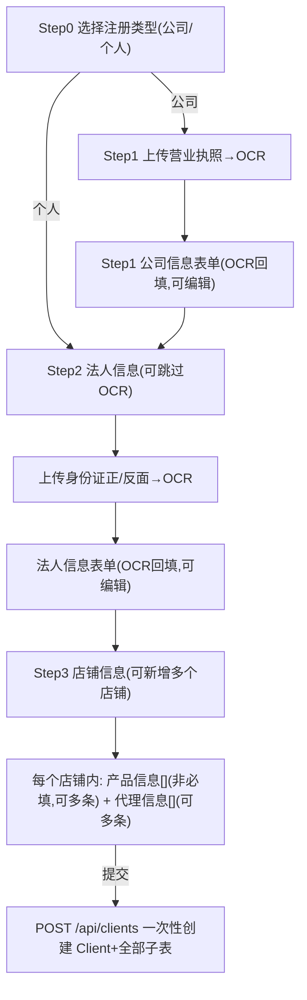

# 授权客户（客户画像）模块 - 技术方案

状态：核心 CRUD + 单条录入向导 + OCR 引擎（Python/RapidOCR 微服务，结构化字段提取在微服务侧完成）均已实现，详见下方「实现状态跟踪」。技术栈遵循 `agent.md`（NestJS 11 + Prisma/MySQL + React 19 + Vite + Ant Design 6；OCR 微服务另用 Python + FastAPI，代码见仓库 `services/ocr-service/`）。当前项目不提供文件上传接口，`Attachment` 数据表仅保留结构，供未来服务端生成文件使用。

## 0. 实现状态跟踪（2026-08-29 更新，后续开发请先看这里）

### ✅ 已完成
- 数据库设计（第 1 节）：`Client/CompanyInfo/LegalRepresentative/Shop/Product/AgentInfo/Attachment` 全部建表，索引、角色过滤（`ownerId`）、软删除（`deletedAt`）、`ActionLog` 审计均已实现。
- 前端单条录入向导（第 2 节）：Step0~Step3 全部完成，Zustand store + 最终一次性提交，个人客户跳过 Step1，流程与 mermaid 图一致。
- OCR 接口骨架（第 3.2/3.3 节）：`POST /api/ocr/business-license`、`POST /api/ocr/id-card`、`OcrProvider` 可替换接口已就绪，前端识别失败提示语（第 8 节兜底方案）已实现。
- **附件（第 5 节）**：`Attachment` 数据表结构保留，供未来服务端生成文件使用；当前项目不提供任何文件上传接口。营业执照/身份证 OCR 识别流程不产生 `Attachment` 记录——图片仅用于识别，识别完成即丢弃（原因见第 3.1.2 节）。

### 0.3 OCR 图片“识别即丢弃”说明

营业执照、身份证图片上传后仅用于 OCR 识别：`OcrController` 收到的 `multipart` 文件（`multer` 默认走内存 `buffer`，不落盘）直接转发给 `OcrService` → `RapidOcrProvider`，识别完成后 HTTP 请求结束，`buffer` 随进程 GC 回收，全程不落盘、不产生 `Attachment` 记录、接口返回结构也不再包含 `fileUrl`。`Attachment` 表结构保留，供未来服务端生成文件使用。详见第 3.1.2 节决策记录。
- **OCR 引擎——RapidOCR Python 微服务（第 3.1 节）已实现**：`services/ocr-service/`（FastAPI + RapidOCR 通用文字识别 + `parsers.py` 结构化字段提取）作为独立 Python 服务落在仓库根目录，提供统一入口 `POST /recognize`（multipart: file, doc_type=business_license|id_card_front|id_card_back），返回原始文本行 `rawText` 与结构化字段 `fields`（统一社会信用代码正则定位+校验位算法校验、身份证号定位+校验位校验 GB 11643-1999、姓名/住所/法定代表人标签定位，均在 `parsers.py` 完成）。识别前会做 CLAHE 对比度增强 + 倾斜纠正 + 多帧取并集的图像预处理，提升手机翻拍件召回率。`RapidOcrProvider` 通过 `OCR_SERVICE_URL` 以 HTTP+multipart 调用该服务，只做字段名 snake_case 到 camelCase 的映射；未启动/未配置该环境变量或调用失败（网络错误/非 2xx）时优雅降级为 `recognized: false`，不阻断向导流程。启动方式见下方 0.2 节及 `services/ocr-service/README.md`。
- 客户 CRUD API（第 7 节）：`POST/GET/GET :id/PATCH/DELETE /api/clients` 已实现，`ClientsService.createClient` 作为单条/未来批量导入的统一入口（第 4.1 节复用原则）已按此结构预留（不含附件上传逻辑）。
- 身份证号明文存储（第 8 节安全约定）已按约定实现，不加密。

### ⚠️ 已知缺口（需尽快补齐）
1. **专用结构化产线未接入**：当前 `services/ocr-service/` 用的是 RapidOCR 通用文字识别 + `parsers.py` 关键词定位/正则校验，不是营业执照/身份证专用的结构化产线，版式差异较大的证件图片可能提取失败。后续如需提升准确率，可在 `parsers.py`/`app.py` 里替换/追加结构化产线调用。
2. **`Product.hasBattery` 字段未接入前端**：数据库和 DTO 都有该字段，但 `ShopEditor.tsx` 产品表格没有对应的输入列，向导里无法编辑，永远落库为默认值 `false`。

### 🚧 未开始（明确排期在后）
- **第 4 节 批量导入**：`client-import` 模块（Excel 解析、内嵌图片提取、BullMQ 队列、失败报告）完全未开始，本次范围内明确不做，但已实现代码（`ClientPayloadDto`/`ClientsService.createClient`）已按可复用方式设计。
- **第 6 节部署方案**：Docker Compose（nginx/api/ocr/mysql/redis）、服务器规格配置均未落地，仍是纯设计阶段（本地开发已可用 `services/ocr-service/` 直接跑通，见 0.2 节）。

> **待确认事项**（本文档已按"默认假设"写完整方案，若与实际不符，确认后我再调整对应章节，标注见文中 ⚠️）：
> 1. 批量导入 Excel 中，公司名/信用代码/法人姓名等文字字段是否已人工填好，图片只是留档附件？（默认假设：**是**，图片不参与批量导入时的二次 OCR，只作为 `Attachment` 留档；OCR 仅用于单条录入向导）
> 2. Excel 如何表达客户 1:N 的店铺/产品/代理关系？（默认假设：主表 + 店铺明细表 + 产品明细表 + 代理明细表，4 个 Sheet 通过"客户唯一标识列"关联）
> 3. 批量导入量级/频率？（默认假设：单批可能上千条，走异步队列 + 失败报告，不同步阻塞请求）

### 0.1 本地自测步骤

通用环境搭建（Node/pnpm 版本、`.env`、MySQL）见根 `README.md`「新环境启动步骤」。本模块新增了**一个可选环境变量** `OCR_SERVICE_URL`（见下方"OCR 微服务启动"说明），未配置时 OCR 识别自动优雅降级为"识别失败，请手动填写"，不影响其余功能自测。已有环境的前提下，自测本模块只需：

1. **同步数据库表结构**（`schema.prisma` 新增了 `Client/CompanyInfo/LegalRepresentative/Shop/Product/AgentInfo/Attachment`）：

   ```bash
   pnpm --filter @funtax/api prisma:migrate   # 本地开发：生成并应用新 migration
   pnpm --filter @funtax/api prisma:generate  # 如上一步已自动生成 client 可跳过
   ```

2. **启动前后端**：

   ```bash
   pnpm dev   # 并行启动 web(5173) + api(3000)，见 apps/web 的 /api 代理配置
   ```

3. **准备一个可登录账号**：客户模块所有接口都需要登录态（JWT），先用现有登录/注册模块（手机号验证码或密码）注册一个账号并登录。

4. **自测入口与要点**：
   - 浏览器打开 `http://localhost:5173/clients`，点"新建客户"进入 4 步向导：
     - Step0 选择"企业/个人"；个人客户会跳过 Step1（公司信息）。
     - Step1/Step2 上传营业执照、身份证正反面图片会调用 OCR 接口：图片**不落盘**，仅用于识别，识别完即丢弃；若未启动 RapidOCR 微服务（见下方启动说明），接口返回 `recognized: false`，走"识别失败，请手动填写"的兜底提示，不阻断流程，手动填完文字字段即可继续；若已启动微服务，回填字段后仍可手动编辑修正。
     - Step3 添加至少一个店铺，可在店铺内添加产品/代理信息（多条动态表格）。
     - 提交后应在客户列表页看到新增记录；可点击详情校验各嵌套字段是否正确落库。因营业执照/身份证不落盘，本次向导不会产生任何 `Attachment` 记录，这是预期行为，非 bug。
   - 直接用 `curl`/Postman 验证 API：`POST /api/clients`（需带登录后的 Cookie/Bearer token）、`GET /api/clients`、`GET /api/clients/:id`、`PATCH /api/clients/:id`、`DELETE /api/clients/:id`。
   - OCR 接口单独验证：`POST /api/ocr/business-license`、`POST /api/ocr/id-card?side=front|back`（multipart，字段名 `file`）；未配置 `OCR_SERVICE_URL` 时会在 API 日志打印 `[OCR] RapidOCR 微服务未配置 OCR_SERVICE_URL，跳过识别` 并返回 `{ recognized: false, fields: {} }`（不含 `fileUrl`，图片不落地），这是当前预期结果，非 bug。
   - 权限自测：普通 `USER` 角色只能看到自己 `ownerId` 下的客户列表；可用两个不同账号互相验证隔离性。

5. **已知不生效的部分**（自测时无需当作 bug 排查，均已在「实现状态跟踪」标注）：`Product.hasBattery` 前端不可编辑；未部署 OCR Python 微服务时 OCR 恒不识别文字字段（图片本身也不会落盘留档）。

### 0.2 OCR 微服务启动说明（RapidOCR，可选，代码位于 `services/ocr-service/`）

Python 微服务代码与前后端一样放在本仓库根目录（不是单独仓库），路径 `services/ocr-service/`（FastAPI + RapidOCR），不属于 pnpm workspace，需要用 Python 独立启动。**不启动此服务不影响自测其余功能**——OCR 会自动降级为"未识别，请手动填写"。

**首次启动**（要求本机已装 Python 3.9+）：

```bash
cd services/ocr-service
python3 -m venv .venv
source .venv/bin/activate            # Windows: .venv\Scripts\activate
pip install -r requirements.txt      # 首次安装较慢，onnxruntime 推理引擎体积较大
uvicorn app:app --host 0.0.0.0 --port 8000
```

首次调用识别接口时会自动下载 RapidOCR 中文识别模型到本地缓存目录（需联网），下载完成后复用缓存，无需重复下载；模型加载完成前第一次请求会稍慢（几秒到十几秒）。

**日常启动**（依赖已装好后）：

```bash
cd services/ocr-service && source .venv/bin/activate && uvicorn app:app --reload --port 8000
```

**接入 Nest API**：在 `apps/api/.env` 增加

```
OCR_SERVICE_URL=http://127.0.0.1:8000
```

重启 `apps/api` 进程后，`RapidOcrProvider` 会自动调用该服务；`GET http://127.0.0.1:8000/health` 可用于确认服务已就绪。若需临时禁用 OCR 识别（如联调其他功能），移除或留空 `OCR_SERVICE_URL` 即可，`RapidOcrProvider` 会自动跳过调用并记录一条 warn 日志。

**服务职责边界**：该服务做 RapidOCR 通用文字识别，并在 `parsers.py` 里完成营业执照/身份证关键字段的定位、正则、校验位算法，输出原始文本行 `rawText` 与结构化字段 `fields`；Nest 侧只做字段名映射，不重复实现规则。详见 `services/ocr-service/README.md`。

**生产部署**：仅监听内网地址，由 Nest API 单向调用，不对公网暴露（呼应第 6 节部署方案的 `ocr` 容器设计）；本服务未做鉴权，依赖网络隔离保证安全。

---

## 1. 数据库设计（已落地，`apps/api/prisma/schema.prisma`）

拆分为主表 + 子表，1:1 用 `@unique` 外键，1:N 用普通外键；5 万+ 级别下常用检索字段均建索引。

```prisma
enum ClientType { COMPANY INDIVIDUAL }

enum ClientStatus {
  PENDING_REVIEW // 审核中
  APPROVED       // 已通过
  DISABLED       // 已禁用
  // 后续新增状态：加枚举值 + migration，同 Role 枚举扩展方式
}

enum Platform { AMAZON TEMU SHEIN TIKTOK ALIEXPRESS ALIBABA_ICBU FRUUGO OTHER }
enum AgentCountry { GB EU US TR CA }
enum AttachmentType { BUSINESS_LICENSE ID_CARD_FRONT ID_CARD_BACK OTHER }

model Client {
  id          String       @id @default(uuid())
  clientType  ClientType
  phone       String
  email       String?
  remark      String?      @db.Text
  status      ClientStatus @default(PENDING_REVIEW)

  ownerId     String                                    // 负责该客户的内部员工
  owner       User         @relation("ClientOwner", fields: [ownerId], references: [id])
  createdById String?
  updatedById String?
  createdBy   User?        @relation("ClientCreatedBy", fields: [createdById], references: [id])
  updatedBy   User?        @relation("ClientUpdatedBy", fields: [updatedById], references: [id])

  companyInfo  CompanyInfo?
  legalRepInfo LegalRepresentative?
  shops        Shop[]
  attachments  Attachment[]

  createdAt DateTime  @default(now())
  updatedAt DateTime  @updatedAt
  deletedAt DateTime? // 软删除

  @@index([ownerId]) @@index([status]) @@index([phone]) @@index([deletedAt])
}

model CompanyInfo {
  id String @id @default(uuid())
  clientId String @unique
  creditCode String   // 统一信用代码 或 个人身份证号
  nameCn String? nameEn String?
  addressCn String? @db.Text
  provinceEn String? cityEn String? postalCode String?
  addressEn String? @db.Text        // 不含国家/省/市/邮编
  client Client @relation(fields: [clientId], references: [id], onDelete: Cascade)
  @@index([creditCode]) @@index([nameEn])
}

model LegalRepresentative {
  id String @id @default(uuid())
  clientId String @unique
  nameCn String
  surnamePinyin String
  givenNamePinyin String
  idNumber String
  idAddress String @db.Text
  client Client @relation(fields: [clientId], references: [id], onDelete: Cascade)
  @@index([idNumber])
}

model Shop {
  id String @id @default(uuid())
  clientId String
  platform Platform
  shopName String
  shopUrl String @db.Text
  brandNames String @db.Text      // 逗号分隔，无品牌填店铺名
  mainCategoryEn String
  client Client @relation(fields: [clientId], references: [id], onDelete: Cascade)
  products Product[]
  agentInfos AgentInfo[]
  createdAt DateTime @default(now())
  @@index([clientId]) @@index([platform])
}

model Product {
  id String @id @default(uuid())
  shopId String
  clientId String                  // 冗余自 shop.clientId，避免按客户查询时 join
  platform Platform
  productName String
  category String
  asinOrSku String
  productUrl String @db.Text
  hasBattery Boolean @default(false)
  shop Shop @relation(fields: [shopId], references: [id], onDelete: Cascade)
  createdAt DateTime @default(now())
  @@index([shopId]) @@index([clientId]) @@index([asinOrSku])
}

model AgentInfo {
  id String @id @default(uuid())
  shopId String
  clientId String                  // 冗余自 shop.clientId
  country AgentCountry
  expectedEffectiveDate DateTime
  agentYears Int
  expiresAt DateTime                // = expectedEffectiveDate + agentYears，后端计算
  agentCompany String
  shop Shop @relation(fields: [shopId], references: [id], onDelete: Cascade)
  createdAt DateTime @default(now())
  @@index([shopId]) @@index([clientId]) @@index([country]) @@index([expiresAt])
}

model Attachment {
  id String @id @default(uuid())
  clientId String
  type AttachmentType
  fileUrl String @db.Text           // 预留字段，见第 5 节
  client Client @relation(fields: [clientId], references: [id], onDelete: Cascade)
  createdAt DateTime @default(now())
  @@index([clientId]) @@index([type])
}
```

**权限过滤**：`Client.ownerId` 用于数据层过滤；`USER` 角色查询自动加 `WHERE ownerId = currentUser.id`，`ADMIN`/`SUPERADMIN` 不加限制，复用现有 `RolesGuard`/`Role` 枚举，不新建权限表。

**审计**：`createdById`/`updatedById` 落表 + 客户增删改调用 `ActionLogService.record()` 写 `ActionLog(action='CREATE_CLIENT'/'UPDATE_CLIENT'/'DELETE_CLIENT')`。

**软删除**：只标记 `deletedAt`，`ClientsService` 统一封装默认过滤条件，避免各处漏写。

**身份证号**：按你的要求，**不做加密处理**，明文存储；仅在列表/详情展示层面看权限控制，不做额外脱敏（如后续合规要求变化，再单独加密迁移）。


---

## 2. 新增客户 - 前端向导（单条录入） ✅ 已实现（`Product.hasBattery` 录入入口除外，见第 0 节）

Ant Design `Steps` 四步向导，一个 Zustand store（非持久化）承载全部步骤数据，**最后一步统一提交一次**，不做逐步落库草稿（避免半成品脏数据；`Client.status` 起始就是 `PENDING_REVIEW`，无需额外 `DRAFT` 状态）。



**Step0**：卡片二选一（公司/个人），决定是否显示 Step1。

**Step1（仅公司）**：`Upload` 上传营业执照 → 调 OCR 识别 → 表单回填（统一信用代码/中英文名/中英文地址/省市/邮编），字段始终可编辑；识别失败或字段缺失时，**在上传区域下方展示一行提示文案**（如"未能自动识别全部信息，请手动核对填写"），不阻断下一步——这是本次约定的唯一兜底方式，不做逐字段置信度高亮。

**Step2（法人/个人信息）**：上传身份证正/反面 → OCR 回填法人中文名/姓氏拼音/名字拼音/身份证号/身份证地址，同样"识别失败→提示语+可编辑"。个人类型从 Step0 直接跳到此步，标题改为"个人信息"，复用同一表单组件。

**Step3（店铺信息）**：`Form.List` 支持新增多个店铺；每个店铺内再嵌套两个 `Form.List`：产品信息（非必填，可多条）、代理信息（可多条，`有效期限` 前端按"生效日期+代理年限"自动算出只读展示，提交时后端复算落库）。

---

## 3. OCR 识别方案（自建开源，不接第三方付费服务）✅ 已实现（Python 微服务当前用通用文字识别 + 规则提取，未接专用结构化产线，见第 0 节缺口 1）

### 3.1 技术选型

- **引擎**：[RapidOCR](https://github.com/RapidAI/RapidOCR)（ONNXRuntime 推理，跨平台稳定）。**当前实现用通用文字识别**（输出文本行），未来如需提升准确率可在 `services/ocr-service/app.py`/`parsers.py` 中替换/追加专用结构化产线，Nest 侧接口不用改。
- **部署形态**：独立 Python 微服务（FastAPI 包一层 HTTP 接口），代码位于仓库 `services/ocr-service/`（与 `apps/`、`packages/` 同级，不属于 pnpm workspace，独立 Python 虚拟环境管理依赖），和 Nest API 同机部署、内网调用，不暴露公网。统一入口 `POST /recognize`（`doc_type` 区分证照类型），识别前做 CLAHE 对比度增强 + 倾斜纠正 + 多帧取并集的图像预处理，提升手机翻拍件召回率。启动方式见第 0.2 节。
- **字段提取层**：营业执照/身份证关键字段有固定标签词（"统一社会信用代码""住所""姓名""公民身份号码"）和固定格式（信用代码 18 位、身份证号 18 位含校验位），在 RapidOCR 输出的原始文本行基础上，用关键词定位 + 正则校验做提取，落在微服务侧 `services/ocr-service/parsers.py`（Nest 侧只做字段名映射，不重复维护规则）。

#### 3.1.1 为什么暂不接结构化产线（记录决策原因，避免后续重复踩坑）

营业执照/身份证的结构化提取通常依赖重量级的版面分析+信息抽取产线，暂缓接入的原因：

1. **不是一行 API 调用，而是一整套重量级产线**：依赖版面分析模型 + 文本检测/识别模型 + 信息抽取模型（部分方案依赖大模型做 key-value 抽取，模型体积数百 MB~数 GB，部分配置甚至需要额外接大模型 API Key 才能完成抽取步骤），远比通用文字识别复杂。
2. **当前开发环境无法闭环验证**：没有真实营业执照/身份证样图，也没有装相关依赖跑过（模型下载体积大、可能需要额外 API Key），如果照文档"盲写"调用代码，字段名、返回结构、模型路径都只能靠猜，很可能交付一段看起来更高级但实际跑不通的代码，风险比"简单但确定能跑"的方案更大。
3. **当前方案是可验证的下限，结构化产线是可选的上限**：RapidOCR 通用识别是最基础、最稳定的能力，配合微服务侧已经写好且可单元测试的正则+校验位提取逻辑（`parsers.py`），能保证"装上依赖就能跑，规则命中的字段是准的"；后续如果准确率不达标，再升级到结构化产线，改动范围收敛在 `services/ocr-service/` 内部，Nest 侧接口不用变。

**升级路径建议**：真正要接结构化产线时，需要先在本地装好对应依赖、准备一批真实样图跑通字段抽取结果，确认字段名和准确率符合预期后，再替换 `app.py`/`parsers.py` 里的识别调用逻辑，Nest 侧接口结构无需改动。

#### 3.1.2 为什么识别完直接丢弃图片，不落盘、不建 Attachment 记录

产品决策：营业执照/身份证图片**只用于 OCR 识别本身**，识别完成后不需要留档，因此：

- `OcrController` 收到的 multipart 文件全程走内存 `buffer`（`multer` 默认 `MemoryStorage`），不写入 `UPLOAD_DIR`；`OcrService` 把 `buffer` 直接转发给 `RapidOcrProvider` 做 HTTP 转发，请求结束后 `buffer` 随 GC 回收。
- `OcrResult` 返回结构不再包含 `fileUrl`，前端 Step 组件也不再调用 `setAttachment` 记录这两类图片，提交 `ClientPayload` 时自然不会为营业执照/身份证生成 `Attachment` 记录。
- **`Attachment` 表结构保留**，供未来服务端生成文件使用；`ClientPayloadDto` 未定义 `attachments` 字段，`client-wizard-store` 也没有 `attachments`/`setAttachment`。

### 3.2 服务接口

```
POST /api/ocr/business-license   (multipart: file)
  → { fields: { creditCode?, nameCn?, addressCn? }, recognized: boolean }

POST /api/ocr/id-card            (multipart: file, query: side=front|back)
  → { fields: { nameCn?, idNumber?, idAddress?, surnamePinyin?, givenNamePinyin? }, recognized: boolean }
```

`BusinessLicenseFields` 里的 `nameEn`/`provinceEn`/`cityEn`/`postalCode`/`addressEn` 由 OCR 微服务离线规则转写产出（拼音转写 + `cpca` 省市区识别 + 邮编查表，见 `services/ocr-service/translate.py`），前端字段仍可编辑覆盖；`IdCardFields` 的 `surnamePinyin`/`givenNamePinyin` 同样由该微服务离线规则转写产出（常见复姓表 + 默认单字姓拆分姓名，再分别转写拼音，见 `translate.py` 的 `translate_person_name`），仅正面（`id_card_front`）识别时返回，无邮编字段。`recognized=false` 或关键字段为空时，前端展示统一提示语，不做逐字段标红。图片本身不落盘、不返回任何文件引用（见 3.1.2 节）。

### 3.3 后端模块结构

```
apps/api/src/ocr/
  ocr.module.ts
  ocr.service.ts              // OcrProvider 接口 + 编排逻辑（引擎无关，不重复实现字段提取规则）✅
  providers/
    rapid-ocr.provider.ts     // 调用本机 RapidOCR 微服务 (HTTP)，字段名 snake_case→camelCase 映射，微服务未就绪时优雅降级 ✅
  ocr.controller.ts           // /api/ocr/business-license, /api/ocr/id-card ✅

services/ocr-service/          // 独立 Python 微服务，仓库根目录同级 apps/、packages/ ✅
  app.py                       // FastAPI，RapidOCR 通用文字识别，/recognize（doc_type=business_license|id_card_front|id_card_back）/health（图片全程内存处理，不落盘）
  parsers.py                   // 关键词定位 + 正则/校验位字段提取逻辑 ✅
  requirements.txt
  README.md                    // 本地启动步骤见此文件或第 0.2 节
```

`OcrProvider` 接口保持"可替换"设计：如果自建效果长期不达标，后续可以再加一个云厂商 Provider 做补充，调用方（`OcrController`、批量导入 Job，见第 4 节）代码不用改。

### 3.4 与批量导入的复用关系

单条录入和批量导入**共用同一个 `OcrService`**（如果批量导入场景确实需要从图片识别字段，见第 4 节的待确认项 1）；无论走哪条路径，结构化字段都由同一个微服务（`parsers.py`）提取，保证口径一致。


---

## 4. 批量导入设计（Excel，含内嵌图片）🚧 未开始

### 4.1 复用原则（代码复用是本节核心约束）

单条录入向导最终会拼出一个统一的 **`ClientPayload`**（`clientType/phone/email/remark/companyInfo/legalRepInfo/shops[{...,products[],agentInfos[]}]`），交给同一个 `ClientsService.createClient(payload, ctx)` 落库（`ctx` 含 `ownerId/createdById` 等审计上下文）。

批量导入的每一行/每组数据，解析后**转换成同样的 `ClientPayload` 结构**，再调用**同一个** `ClientsService.createClient()`。这样字段校验、`expiresAt` 计算、`Attachment` 落表、`ActionLog` 审计等逻辑只写一份，单条/批量都不会跑偏。

```
apps/api/src/clients/
  clients.module.ts
  clients.service.ts          // createClient(payload, ctx) —— 单条/批量共用的落库入口
  dto/client-payload.dto.ts   // 单条向导提交 与 批量导入行 共用的校验 Schema
  import/
    client-import.controller.ts   // POST /api/clients/import (上传Excel)
    client-import.processor.ts    // BullMQ Worker：解析→转换成ClientPayload[]→逐条调用 createClient
    excel-parser.service.ts       // 用 exceljs 解析工作簿 + 提取内嵌图片
```

### 4.2 Excel 解析（含图片）

- 用 `exceljs`（Node 生态里少数能读取 `.xlsx` 内嵌图片并拿到图片"锚点"所在行列的库）：
  - 读取"主表"Sheet（客户+公司+法人字段，一行一个客户，用手机号或信用代码做唯一标识列）。
  - 读取"店铺明细"/"产品明细"/"代理明细" Sheet，按标识列分组，重建 1:N 嵌套结构。
  - 遍历工作簿 `worksheet.getImages()`，按图片锚点行号映射回对应客户行的"营业执照"/"身份证正面"/"身份证反面"列，图片二进制直接存本地（见第 5 节），生成 `Attachment` 记录，**不强制重新走 OCR**（⚠️ 待确认项 1：如果实际需求是图片需要重新识别补全文字字段，会在 `excel-parser.service.ts` 里插入调用第 3 节的 `OcrService` 这一步，接口不用变，只是多一次调用）。

### 4.3 异步处理 + 失败报告

- 批量导入走 **BullMQ 队列**（`agent.md` 已规划 Redis + BullMQ），避免上传接口同步阻塞：`POST /api/clients/import` 只做文件校验+入队，立即返回 `jobId`；前端轮询/或者提供"导入记录"列表页查看进度。
- 每行独立 try/catch，失败不影响其他行；处理完成后生成**错误报告**（行号 + 失败原因，如"信用代码格式不对""手机号缺失"），支持下载 CSV，成功的行照常创建 `Client(status=PENDING_REVIEW)`。
- 并发控制：Worker 设置 `concurrency`，避免大批量导入把 OCR/DB 打满（呼应第 6 节的资源隔离）。

---

## 5. 附件

- 当前项目**不提供任何文件上传接口**。
- `Attachment` 数据表（`schema.prisma`）结构保留，供**未来服务端生成文件**（非用户上传）的场景使用；具体生成/写入逻辑暂不实现。
- 若后续确有用户上传附件的需求，需另行设计并实现存储服务（本地磁盘或对象存储）。

---

## 6. 部署方案（单台云服务器）🚧 未开始

### 6.1 拓扑

```
云服务器（1台，Docker Compose 编排）
├── nginx        反向代理 + 前端静态资源(apps/web/dist) + HTTPS
├── api          Nest.js 容器，端口 3000（内网）
├── ocr          Python + RapidOCR 微服务容器（代码见仓库 services/ocr-service/），端口 8000，仅 api 可调（内网）
├── mysql        业务数据库容器（或用云厂商 RDS，视预算）
├── redis        BullMQ 队列 + 验证码频控
└── /data/uploads 本地图片存储卷（Docker volume 挂载宿主机磁盘）
```

### 6.2 服务器规格建议

批量导入（含图片解析 + 可能的 OCR 补充识别）是**唯一的资源尖峰场景**，据此给规格建议：

| 项 | 建议 | 原因 |
| --- | --- | --- |
| CPU | **8 核起** | RapidOCR CPU 推理 + Excel/图片解析 + Nest/MySQL 同机运行，批量导入时多任务并发 |
| 内存 | **16GB 起** | RapidOCR 模型常驻内存 + MySQL + Node 进程 + 批量导入时 Excel 全量加载解析 |
| 磁盘 | **100GB+ SSD，且预留扩容空间** | 图片本地存储会随客户量线性增长（5万+ 客户 × 3 张证件图，且批量导入还会有原始 Excel 归档），需要定期评估扩容 |
| 系统盘/数据盘分离 | 建议 | `/data/uploads` 单独挂数据盘，避免撑满系统盘影响服务 |

### 6.3 资源隔离与限流

- Docker Compose 给 `ocr` 容器设 `cpus`/`mem_limit`，防止批量导入触发的识别任务把 `api`/`mysql` 挤死。
- BullMQ Worker 设置 `concurrency`（如 2~4），批量导入排队处理，不追求瞬时跑完，保证前台在线用户的接口响应不受影响。
- Nginx 对 `/api/clients/import` 等上传类接口单独设置更大的 `client_max_body_size` 和更长的超时时间。


---

## 7. 后端 API 一览

```
POST   /api/ocr/business-license        营业执照识别（单条录入向导用）
POST   /api/ocr/id-card                 身份证识别（单条录入向导用）

POST   /api/clients                     创建客户（单条，Steps 提交，嵌套 shops/products/agentInfos）
GET    /api/clients                     列表（USER 只返回 ownerId=自己，ADMIN/SUPERADMIN 全量；分页+筛选）
GET    /api/clients/:id                 详情
PATCH  /api/clients/:id                 更新
DELETE /api/clients/:id                 软删除（写 deletedAt）

POST   /api/clients/import              批量导入（上传 Excel，入队，返回 jobId）—— 🚧 未实现
GET    /api/clients/import/:jobId       查询导入进度/结果 —— 🚧 未实现
GET    /api/clients/import/:jobId/errors.csv   下载失败行报告 —— 🚧 未实现
```

所有增删改统一通过 `ClientsService.createClient/updateClient/deleteClient` 落库并写 `ActionLog`，保证单条/批量、创建/编辑口径一致。

---

## 8. 安全性小结（按本次约定）

- 身份证号：**明文存储，不加密**。
- 图片：本地磁盘存储，路由需登录态才能访问，不做公网直链；后续要接对象存储时按第 5 节的"相对路径"设计平滑切换。
- OCR 识别失败：仅在页面展示一条提示语，不做逐字段高亮/置信度展示，用户自行核对修改。
- 数据不出内网：自建 OCR 意味着证件图片和文字全程留在自己服务器，不经过第三方接口，合规性优于调用云厂商 OCR。

---

## 9. 后续实现顺序建议

1. `ClientsModule`（CRUD + 角色过滤 + 软删除 + ActionLog），先支持单条创建，跑通 `ClientPayload` 结构。
2. `OcrModule`（先接 RapidOCR 微服务 mock/最小可用版本），联调单条录入向导的 Step1/Step2。
3. 前端向导页面（Steps + Form.List + Zustand store）。
4. `client-import`（Excel 解析 + BullMQ Worker + 失败报告），复用第 1 步的 `ClientsService.createClient`。
5. Docker Compose 部署配置（nginx/api/ocr/mysql/redis + 本地存储卷）。

---

## 10. 待确认事项汇总（见文首，重复列出便于跟踪）

1. 批量导入 Excel 中文字字段是否已人工填好、图片仅作留档（默认：是，不重新 OCR）。
2. Excel 表达 1:N 关系的具体结构（默认：主表 + 3 张明细表，用标识列关联）。
3. 批量导入的量级/频率（默认：可能上千条，走异步队列）。
